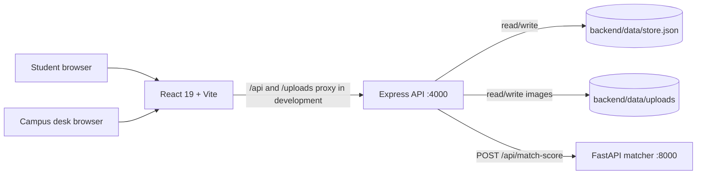

# Campus Loop

**A physical-first campus lost-and-found platform.** Items enter the public feed only after campus staff receive and log them. Students can search verified finds, report missing belongings, submit ownership claims, and follow their own activity. Desk staff manage intake, report review, claim verification, and item hand-offs.

## Highlights

- **Verified custody:** only campus desk intake creates found-item listings.
- **Controlled visibility:** found items default to Public, with a Private option for desk-only records. Student lost reports remain private to the student and campus staff.
- **Moderated lost reports:** Admins can review a prefilled report, edit its details, approve it, or reject it. Approval records the request in the private campus register; it does not publish it to other students.
- **Photo-backed intake:** desk staff can capture or attach a photo. Images appear on public item listings and remain stored locally.
- **In-person claim release:** students receive a one-time four-digit OTP. Admin verification records the recipient and resolves the item.
- **Activity history:** students see their own reports and claims; Admins can review the campus-wide custody register and audit trail.
- **Local persistence:** JSON files and uploaded images replace an external database for this prototype.
- **Potential matches:** a lightweight Python text matcher compares lost and found descriptions. Scores above 65% are flagged for desk review.

## Architecture



### Service responsibilities

| Service | Responsibilities | Local address |
| --- | --- | --- |
| React, Vite, Tailwind CSS, Lucide | Role sign-in, student feed/history, desk intake/review/history, photo capture | `http://localhost:5173` |
| Node.js, Express | Item visibility, moderation, claims and OTP verification, audit events, JSON persistence, image serving | `http://localhost:4000` |
| Python, FastAPI | Normalizes lost/found text and returns a similarity score | `http://localhost:8000` |

In development, Vite proxies both `/api` and `/uploads` to Express. Express calls FastAPI for text matching. The matcher combines `difflib.SequenceMatcher` and token overlap; it has no model download or external service dependency.

### Project structure

```text
ai-service/
	main.py                 FastAPI similarity endpoint
	requirements.txt        Python dependencies
backend/
	server.js               Express routes and local persistence
	data/store.json         Runtime items, claims, and audit history (generated)
	data/uploads/           Runtime item photos (generated)
src/
	App.jsx                 Student and Admin workflows
	App.css                 Application styles
	index.css               Global styles and Tailwind import
vite.config.js            Vite plugins and development proxies
README.md
```

Runtime store and image files are ignored by Git. Back them up separately if the local prototype data must be retained.

## Workflows

### Campus desk

1. Sign in using **Campus desk**.
2. Log an item physically handed to the desk, optionally capture a photo, and choose Public or Private. Public is the default.
3. Review student lost reports. **Review & approve** opens an editable form prefilled with the report; approving or rejecting writes a private review record.
4. Review claim details and verify the student's OTP during the in-person hand-off. The item is resolved and its recipient is recorded in Admin history.
5. Use **Full history** to inspect intakes, reports, moderation actions, claims, and release activity.

### Student

1. Sign in using **Student** with a name, college email, and roll number.
2. Browse public desk-verified finds. Private found items and other students' lost reports are not included.
3. Submit a claim with proof of ownership to receive an OTP, or submit a lost report for staff review.
4. Use **My history** to follow reports and claims. Active claim OTPs remain visible until the desk verifies or closes the claim.

## API overview

Admin routes expect the prototype header `X-Campus-Role: admin`.

| Method | Route | Purpose |
| --- | --- | --- |
| `GET` | `/api/health` | Express service health and record counts |
| `GET` | `/api/items?type=FOUND&status=OPEN` | Public found feed; private items are excluded. Public lost-report queries are denied. |
| `POST` | `/api/admin/found-item` | Log a found item, photo, shelf, private note, and visibility |
| `GET` | `/api/admin/items?status=OPEN` | Desk found-item queue, including private items |
| `POST` | `/api/student/lost-report` | Submit a private student report |
| `GET` | `/api/admin/lost-reports?status=OPEN` | Admin lost-report review queue |
| `POST` | `/api/admin/lost-reports/:id/review` | Approve with edited fields or reject a report |
| `POST` | `/api/claims/create` | Create a claim and return its four-digit OTP |
| `GET` | `/api/student/history?email=...` | Student report and claim history |
| `GET` | `/api/admin/claims?status=PENDING` | Desk claim queue; OTPs are omitted |
| `POST` | `/api/admin/verify-otp` | Verify hand-off, record recipient, and resolve item |
| `POST` | `/api/admin/close-case` | Close an open found-item case |
| `GET` | `/api/admin/history` | Full Admin item register and audit events |

The AI service exposes `POST /api/match-score` with `{ "lost_text": "...", "found_text": "..." }` and returns `{ "similarity_score": 0-100, "is_match": true|false }`. Interactive FastAPI documentation is available at `http://localhost:8000/docs` while the AI service is running.

## Run locally on Windows

Use three PowerShell terminals from the project root. Requirements: Node.js 20+ and Python 3.10+.

### 1. AI matcher

```powershell
cd ai-service
py -m venv .venv
.\.venv\Scripts\Activate.ps1
python -m pip install -r requirements.txt
uvicorn main:app --reload --port 8000
```

### 2. Express API

```powershell
cd backend
npm install
npm run dev
```

The API listens on `http://localhost:4000`. Optional environment variables: `PORT` (API port), `AI_SERVICE_URL` (matcher URL), and `CAMPUS_LOOP_DATA_DIR` (local JSON/photo directory).

### 3. Frontend

From the project root in the third terminal:

```powershell
npm install
npm run dev
```

Open the Vite URL printed in the terminal, normally `http://localhost:5173`.

### Quality checks

From the project root:

```powershell
npm run lint
npm run build
```

The FastAPI service can be syntax-checked with `python -m py_compile ai-service/main.py` from the root.

## Data and security notes

- The Express process loads and updates `backend/data/store.json`; photos are stored under `backend/data/uploads/`. No PostgreSQL, MongoDB, or other external database is used.
- Student history is keyed by email in this demo. The role selection and `X-Campus-Role` header are not authentication; requests can be impersonated.
- Before deployment, add server-verified campus identity, authorization tied to that identity, request validation/rate limits, and protected access to personal history and Admin operations.
- Private desk notes, student lost-report details, and release-recipient information are not returned by public found-item responses.
- The AI score is a lightweight text similarity heuristic, not proof of ownership. Staff must verify claims in person.
